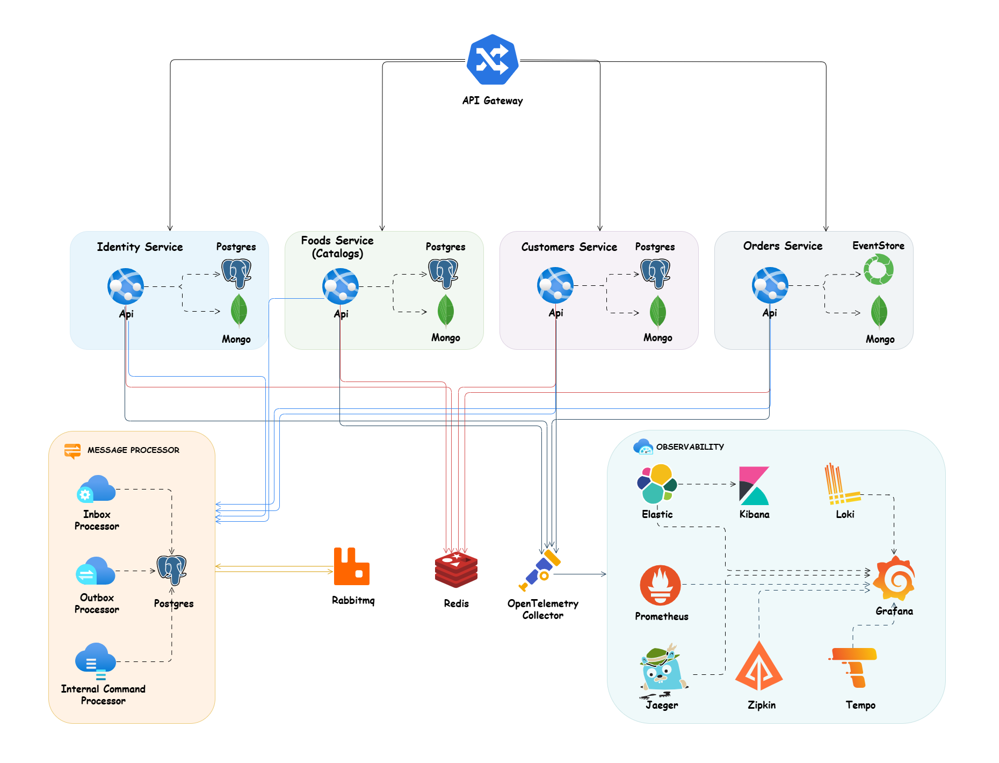

# Food Delivery Microservices - FoodSphere Platform

**Author:** Jai Madhav

## Overview

FoodSphere Platform is a cloud-native application built with **.NET Aspire**, **.NET Core**, and a set of backend architecture patterns, including:

- Microservices Architecture
- Vertical Slice Architecture
- CQRS Pattern
- Domain-Driven Design (DDD)
- Event-Driven Architecture

The project is intended as a technical sample. The focus is on architecture, implementation patterns, and infrastructure rather than on a business product.

> This application is not business-oriented. The main goal is to demonstrate different technologies, software design approaches, and principles used to build a microservices application.

## Table of Contents

- [Features](#features)
- [Plan](#plan)
- [Technologies and Libraries](#technologies-and-libraries)
- [Application Architecture](#application-architecture)
- [Application Structure](#application-structure)
- [Prerequisites](#prerequisites)
- [Setup](#setup)
- [How to Run](#how-to-run)
- [Using Docker Compose](#using-docker-compose)
- [Using Kubernetes](#using-kubernetes)
- [Contribution](#contribution)
- [Project References](#project-references)
- [License](#license)

## Features

- Microservices and Vertical Slice Architecture as the main structure
- Event-Driven Architecture with RabbitMQ and MassTransit
- Domain-Driven Design in most services such as Customers and Catalogs
- Event Sourcing and EventStoreDB in audit-based services such as Orders and Payment
- Data-centric CRUD architecture in Identity Service
- CQRS with MediatR and separate read and write models
- OpenTelemetry Collector for tracing, logs, and metrics with Jaeger, Tempo, Loki, Kibana, and Prometheus
- Outbox Pattern for guaranteed or at-least-once delivery
- Inbox Pattern for idempotency and exactly-once style processing on the receiver side
- Unit Tests with NSubstitute
- Integration Tests and End-to-End Tests with Testcontainers
- Minimal APIs for request handling
- Fluent Validation with a MediatR validation pipeline behavior
- PostgreSQL for the write database
- MongoDB and Elasticsearch for the read database
- Docker and docker-compose deployment
- YARP reverse proxy as the API Gateway
- OpenTelemetry for metrics and distributed traces
- .NET Aspire for cloud-native orchestration and developer experience
- Helm, Kubernetes, and Kustomize support for deployment

## Technologies and Libraries

- [.NET 9](https://dotnet.microsoft.com/download)
- [MassTransit](https://github.com/MassTransit/MassTransit)
- [StackExchange.Redis](https://github.com/StackExchange/StackExchange.Redis)
- [Npgsql Entity Framework Core Provider](https://www.npgsql.org/efcore/)
- [EventStore-Client-Dotnet](https://github.com/EventStore/EventStore-Client-Dotnet)
- [FluentValidation](https://github.com/FluentValidation/FluentValidation)
- [Swagger & Swagger UI](https://github.com/domaindrivendev/Swashbuckle.AspNetCore)
- [Serilog](https://github.com/serilog/serilog)
- [Polly](https://github.com/App-vNext/Polly)
- [Scrutor](https://github.com/khellang/Scrutor)
- [Opentelemetry-dotnet](https://github.com/open-telemetry/opentelemetry-dotnet)
- [DuendeSoftware IdentityServer](https://github.com/DuendeSoftware/IdentityServer)
- [Newtonsoft.Json](https://github.com/JamesNK/Newtonsoft.Json)
- [Rabbitmq-dotnet-client](https://github.com/rabbitmq/rabbitmq-dotnet-client)
- [AspNetCore.Diagnostics.HealthChecks](https://github.com/Xabaril/AspNetCore.Diagnostics.HealthChecks)
- [Microsoft.AspNetCore.Authentication.JwtBearer](https://www.nuget.org/packages/Microsoft.AspNetCore.Authentication.JwtBearer)
- [NSubstitute](https://github.com/nsubstitute/NSubstitute)
- [StyleCopAnalyzers](https://github.com/DotNetAnalyzers/StyleCopAnalyzers)
- [Mapperly](https://github.com/riok/mapperly)
- [IdGen](https://github.com/RobThree/IdGen)

## Application Architecture

The system exposes one public API through an API Gateway. Clients communicate with the gateway over HTTP, and the gateway routes the request to the appropriate microservice.

Each microservice has its own REST API and runs with direct access to its own dependencies such as databases, files, and local transactions. These dependencies are not exposed outside that service. The services are decoupled, autonomous, and able to run independently.



The communication model is primarily event-driven. Services publish and subscribe to events instead of depending on tight service-to-service coupling. This keeps services isolated and reduces cross-service error handling.

For immediate communication needs, the application also uses synchronous REST calls. gRPC is planned for future use.

The project uses CQRS to separate write and read models:

- The write side uses PostgreSQL for consistency and ACID transactions.
- The read side uses MongoDB for query performance, nested documents, and scalability.

To keep data and messages reliable, the project uses the Outbox Pattern. A business transaction stores both the data and the outgoing message, and a background process later publishes pending messages to the broker. This gives at-least-once delivery. The receiver side uses the Inbox Pattern to support idempotency and avoid duplicate effects from repeated messages.

RabbitMQ is used as the message broker, with MassTransit handling asynchronous communication. For synchronous communication, REST is used now and gRPC will be used later where needed.

The API Gateway is implemented with YARP. It keeps the internal services hidden from clients and can also support routing, authentication, authorization, caching, and load balancing.

## Application Structure

The project uses Vertical Slice Architecture together with feature folders.

Instead of organizing code by technical layers such as controllers, services, and repositories, each feature keeps its own request handling, validation, mapping, and data access together. This reduces jumping between layers and keeps the logic for a feature in one place.


With CQRS, the code is split into small command and query slices. This improves separation of concerns and makes changes local to a single use case. It also fits well with MediatR pipeline behaviors and feature-based organization.

## Prerequisites

1. HTTPS support for local API hosting and a valid development certificate
2. Git
3. Latest .NET version
4. Visual Studio, Rider, or VS Code
5. Docker
6. Around 10 GB of free disk space
7. A clone of this repository that builds successfully
8. Infrastructure services started with Docker Compose
9. The `food-delivery-microservices.sln` solution opened in the IDE

## Setup

### Dev Certificate

The APIs run over HTTPS, so a trusted development certificate is required.

#### Windows and PowerShell

```powershell
dotnet dev-certs https --clean
dotnet dev-certs https -ep $env:USERPROFILE\.aspnet\https\aspnetapp.pfx -p <CREDENTIAL_PLACEHOLDER>
dotnet dev-certs https --trust
```

#### Linux and WSL

```bash
dotnet dev-certs https --clean
dotnet dev-certs https -ep ${HOME}/.aspnet/https/aspnetapp.pfx -p <CREDENTIAL_PLACEHOLDER>
dotnet dev-certs https --trust
```

`dotnet dev-certs https --trust` is supported on macOS and Windows. On Linux, trust the certificate using the method supported by the distribution.

### Conventional Commit

The app uses Conventional Commits. Enforcement is done with Commitlint and Husky.

Install NPM dependencies:

```bash
npm init
npm install husky --save-dev
npm install --save-dev @commitlint/config-conventional @commitlint/cli
```

Add scripts to `package.json`:

```json
{
  "scripts": {
    "prepare": "husky && dotnet tool restore",
    "install-dev-cert-bash": "curl -sSL https://aka.ms/getvsdbgsh | bash /dev/stdin -v vs2019 -l ~/vsdbg"
  }
}
```

Create `commitlint.config.js`:

```js
module.exports = { extends: '@commitlint/config-conventional' };
```

Create the Husky folder and add the commit message hook:

```bash
mkdir .husky
npx husky add .husky/commit-msg 'npx --no -- commitlint --edit ${1}'
npm run prepare
npm run install-dev-cert-bash
```

### Formatting

Formatting uses a mix of CSharpier and dotnet format.

```bash
dotnet new tool-manifest
dotnet tool install csharpier
npm run prepare
```

A watcher can be configured in the IDE to run formatting on save. The repository also uses Husky hooks for formatting enforcement.

### Analizers

Roslyn analyzers are configured in `.editorconfig`:

- StyleCop
- Roslynator
- Meziantou.Analyzer
- Microsoft.VisualStudio.Threading.Analyzers

## How to Run

The application can be run in the IDE, with Docker Compose, or with Kubernetes.

For API testing, the repository includes REST Client request files in the `_httpclients` folder. Swagger is available at `/swagger` for each microservice.

The application uses Ethereal Email as a fake SMTP provider for local email testing. Sent emails can be viewed in the Ethereal messages panel. Temporary credentials are stored in the relevant `appsettings.json` file.

## Using Docker Compose

Create a development certificate for Docker Compose:

```powershell
dotnet dev-certs https --clean
dotnet dev-certs https -ep ${HOME}/.aspnet/https/aspnetapp.pfx -p $CREDENTIAL_PLACEHOLDER$
dotnet dev-certs https --trust
```

The certificate is mounted into containers with `~/.aspnet/https:/https:ro`.

Run the infrastructure services first:

```bash
docker-compose -f ./deployments/docker-compose/docker-compose.infrastructure.yaml up -d
```

Then run the services:

```bash
docker-compose -f ./deployments/docker-compose/docker-compose.services.yaml up -d
```

For development builds from source:

```bash
docker-compose -f ./deployments/docker-compose/docker-compose.services.yaml -f ./deployments/docker-compose/docker-compose.services.dev.yaml up
```

For debugging in VS Code:

```bash
docker-compose -f ./deployments/docker-compose/docker-compose.services.yaml -f ./deployments/docker-compose/docker-compose.services.debug.yaml up -d
```

After startup, the environment should include:

- PostgreSQL
- RabbitMQ
- MongoDB
- the microservices

Useful Docker commands:

```powershell
docker-compose -f .\docker-compose.yaml up
docker-compose -f .\docker-compose.yaml build --no-cache
docker-compose kill
docker-compose down -v
docker ps
docker ps -a
```

## Using Kubernetes

The repository supports plain Kubernetes manifests, Kustomize, and Helm.

### Plain Kubernetes

Environment variables in manifests can be substituted with `envsubst`.

Example `.env` file:

```env
export ASPNETCORE_ENVIRONMENT=docker
export REGISTRY=ghcr.io
```

Apply a manifest directly:

```bash
envsubst < deploy.yml | kubectl apply -f -
```

Generate a compiled manifest file:

```bash
envsubst < deploy.yml > compiled_deploy.yaml
```

The repository includes a shell script at `./deployments/k8s/kubernetes/kubectl`. It loads the `.env` file, substitutes variables, and then forwards the command to the real `kubectl`.

```bash
#!/bin/bash
ENV_FILE=.env

source $ENV_FILE

if [[ "$1" == "apply" ]] || [[ "$1" == "delete" ]]; then
    envsubst < $3 | kubectl $1 $2 -
else
    kubectl "$@"
fi
```

### Installation

Install the Kubernetes infrastructure manifests with:

```bash
./kubectl apply -f ./deployments/k8s/kubernetes/infrastructure.yaml
```

## Contribution

The project is in development status. Pull requests and issues are welcome.
